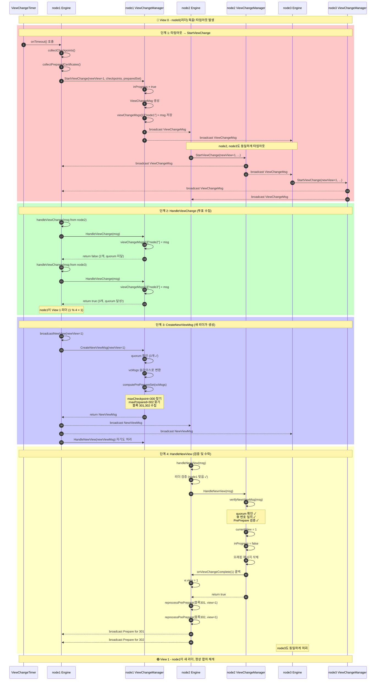
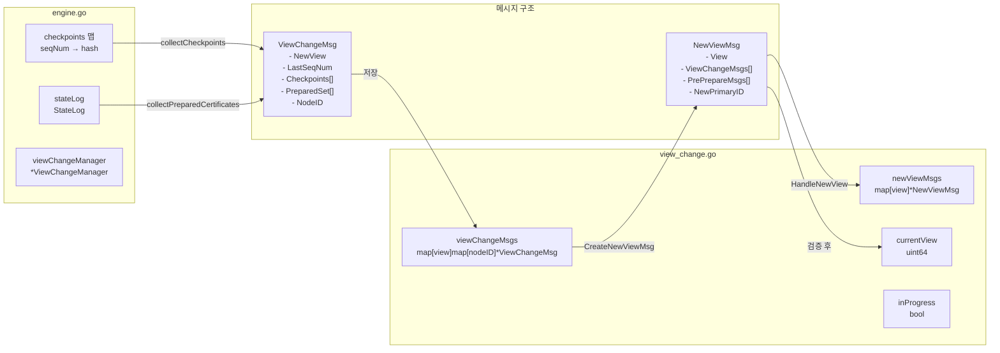
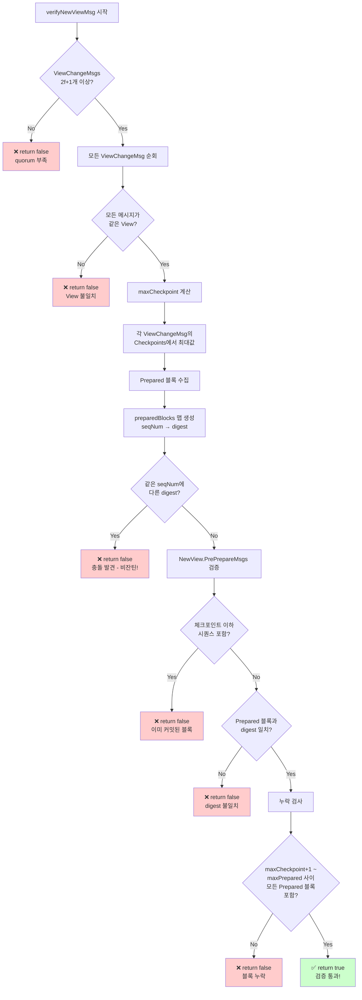
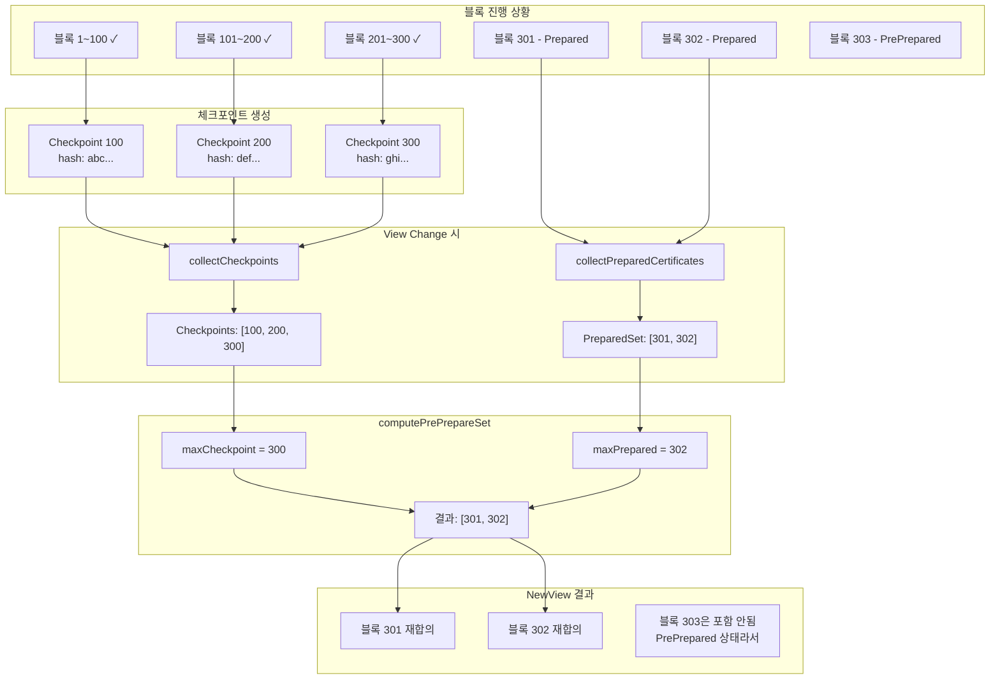
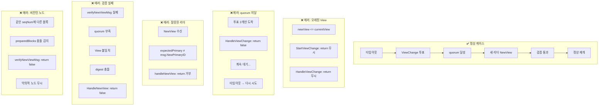
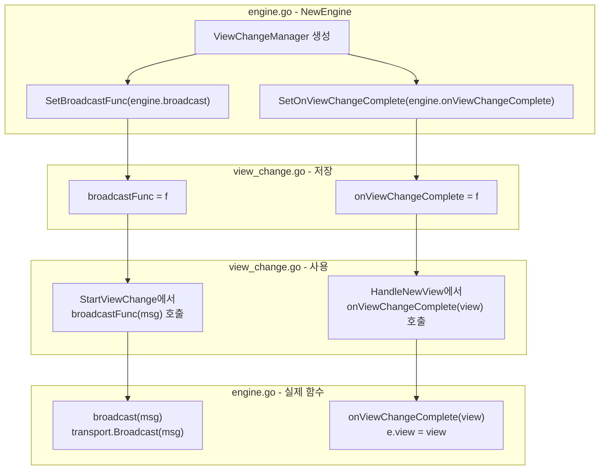

# PBFT View Change 완전 플로우 다이어그램

## 파일 구조

```
engine.go         - PBFT 메인 엔진, ViewChange 시작/처리
view_change.go    - ViewChange 프로토콜 로직, 메시지 관리
```

---

## 1. 전체 시퀀스 다이어그램 (상세)



---

## 2. 함수 호출 플로우차트 (engine.go ↔ view_change.go)

```mermaid
flowchart TD
    subgraph 타이머["⏰ 타임아웃 발생"]
        A[10초 경과<br/>리더 응답 없음]
    end

    subgraph engine_start["📁 engine.go - startViewChange"]
        B[startViewChange 호출]
        B1[newView = view + 1]
        B2[collectCheckpoints<br/>체크포인트 맵 → 슬라이스]
        B3[collectPreparedCertificates<br/>Prepared 상태 블록 수집]
    end

    subgraph vcm_start["📁 view_change.go - StartViewChange"]
        C[StartViewChange 호출]
        C1[newView <= currentView?]
        C2[inProgress = true]
        C3[ViewChangeMsg 생성]
        C4["viewChangeMsgs[newView][nodeID] = msg"]
        C5[broadcastFunc 호출]
    end

    A --> B
    B --> B1 --> B2 --> B3 --> C
    C --> C1
    C1 -->|Yes| C_END[return 무시]
    C1 -->|No| C2 --> C3 --> C4 --> C5

    subgraph broadcast["📡 네트워크 브로드캐스트"]
        D[ViewChangeMsg → 다른 노드들]
    end

    C5 --> D

    subgraph engine_handle["📁 engine.go - handleViewChange"]
        E[handleViewChange 호출]
        E1[json.Unmarshal 디코딩]
        E2[newView <= currentView?]
    end

    subgraph vcm_handle["📁 view_change.go - HandleViewChange"]
        F[HandleViewChange 호출]
        F1["viewChangeMsgs[newView] 맵 초기화"]
        F2["viewChangeMsgs[newView][nodeID] = msg"]
        F3["len >= quorumSize?"]
    end

    D --> E
    E --> E1 --> E2
    E2 -->|Yes| E_END[return 무시]
    E2 -->|No| F
    F --> F1 --> F2 --> F3
    F3 -->|No| F_WAIT[return false<br/>더 기다림]
    F3 -->|Yes| G

    subgraph engine_check["📁 engine.go - 리더 확인"]
        G[quorum 달성!]
        G1["newPrimaryIdx = newView % len(validators)"]
        G2[내가 새 리더?]
    end

    G --> G1 --> G2
    G2 -->|No| G_WAIT[NewView 메시지 대기]
    G2 -->|Yes| H

    subgraph engine_broadcast["📁 engine.go - broadcastNewView"]
        H[broadcastNewView 호출]
    end

    subgraph vcm_create["📁 view_change.go - CreateNewViewMsg"]
        I[CreateNewViewMsg 호출]
        I1["len(viewChangeMsgs) >= quorum?"]
        I2[맵 → 슬라이스 변환]
        I3[computePrePrepareSet 호출]
    end

    subgraph vcm_compute["📁 view_change.go - computePrePrepareSet"]
        J[computePrePrepareSet]
        J1[maxCheckpoint 찾기<br/>체크포인트 중 최대값]
        J2[maxPrepared 찾기<br/>Prepared 중 최대값]
        J3[preparedBlocks 맵 수집]
        J4["for seqNum = maxCheckpoint+1 to maxPrepared"]
        J5[prePrepares 슬라이스 생성]
    end

    H --> I
    I --> I1
    I1 -->|No| I_FAIL[return nil]
    I1 -->|Yes| I2 --> I3 --> J
    J --> J1 --> J2 --> J3 --> J4 --> J5

    subgraph vcm_newview["📁 view_change.go - NewViewMsg 생성"]
        K[NewViewMsg 생성]
        K1["View: newView"]
        K2["ViewChangeMsgs: 투표들"]
        K3["PrePrepareMsgs: 하다만 블록들"]
        K4["NewPrimaryID: 내 ID"]
    end

    J5 --> K
    K --> K1 --> K2 --> K3 --> K4

    subgraph broadcast2["📡 NewView 브로드캐스트"]
        L[NewViewMsg → 다른 노드들]
    end

    K4 --> L

    subgraph engine_handlenew["📁 engine.go - handleNewView"]
        M[handleNewView 호출]
        M1[json.Unmarshal 디코딩]
        M2[newView <= currentView?]
        M3["expectedPrimary = View % len"]
        M4[리더가 맞는지 검증]
    end

    L --> M
    M --> M1 --> M2
    M2 -->|Yes| M_END[return 무시]
    M2 -->|No| M3 --> M4
    M4 -->|틀림| M_REJECT[return 거부]
    M4 -->|맞음| N

    subgraph vcm_handlenew["📁 view_change.go - HandleNewView"]
        N[HandleNewView 호출]
        N1[verifyNewViewMsg 호출]
    end

    subgraph vcm_verify["📁 view_change.go - verifyNewViewMsg"]
        O[verifyNewViewMsg]
        O1["len(ViewChangeMsgs) >= quorum?"]
        O2[모든 메시지가 같은 View?]
        O3[PrePrepare 집합 검증]
        O4[Digest 충돌 확인]
        O5[누락된 블록 확인]
    end

    N --> N1 --> O
    O --> O1
    O1 -->|No| O_FAIL[return false]
    O1 -->|Yes| O2
    O2 -->|No| O_FAIL
    O2 -->|Yes| O3 --> O4 --> O5

    subgraph vcm_complete["📁 view_change.go - 완료 처리"]
        P[검증 통과!]
        P1["newViewMsgs[View] = msg"]
        P2[currentView = newView]
        P3[inProgress = false]
        P4[오래된 메시지 삭제]
        P5[onViewChangeComplete 콜백]
    end

    O5 --> P
    P --> P1 --> P2 --> P3 --> P4 --> P5

    subgraph engine_callback["📁 engine.go - onViewChangeComplete"]
        Q[onViewChangeComplete 콜백]
        Q1[e.view = newView]
        Q2[메트릭 업데이트]
        Q3[타이머 리셋]
    end

    P5 --> Q
    Q --> Q1 --> Q2 --> Q3

    subgraph engine_reprocess["📁 engine.go - reprocessPrePrepare"]
        R[reprocessPrePrepare 호출]
        R1[prePrepare.View = newView]
        R2[StateLog에 저장]
        R3[Prepare 메시지 브로드캐스트]
    end

    Q3 --> R
    R --> R1 --> R2 --> R3

    subgraph final["🟢 정상 합의 재개"]
        S[View 1 시작!]
        S1[새 리더가 블록 제안]
        S2[Prepare → Commit → Execute]
    end

    R3 --> S
    S --> S1 --> S2
```



---

## 3. 데이터 흐름 다이어그램



---

## 4. 상태 전이 다이어그램

```mermaid
stateDiagram-v2
    [*] --> 정상합의: Engine.Start()

    state 정상합의 {
        [*] --> 블록제안
        블록제안 --> PrePrepare: 리더가 제안
        PrePrepare --> Prepare: 2f+1 Prepare
        Prepare --> Commit: 2f+1 Commit
        Commit --> 실행: executeBlock
        실행 --> 블록제안: 다음 블록
    }

    정상합의 --> 타임아웃: 10초 리더 응답 없음
    
    state 타임아웃 {
        [*] --> startViewChange
        startViewChange --> collectCheckpoints
        collectCheckpoints --> collectPreparedCertificates
        collectPreparedCertificates --> VCM_StartViewChange
    }

    타임아웃 --> ViewChange진행중: inProgress = true

    state ViewChange진행중 {
        [*] --> ViewChangeMsg브로드캐스트
        ViewChangeMsg브로드캐스트 --> HandleViewChange
        HandleViewChange --> 투표수집중
        
        state 투표수집중 {
            [*] --> 대기
            대기 --> 메시지도착: ViewChangeMsg 수신
            메시지도착 --> quorum확인
            quorum확인 --> 대기: 부족
            quorum확인 --> 리더확인: 달성!
        }
        
        리더확인 --> CreateNewViewMsg: 내가 리더
        리더확인 --> NewView대기: 리더 아님
        CreateNewViewMsg --> NewViewMsg브로드캐스트
    }

    ViewChange진행중 --> HandleNewView: NewViewMsg 수신

    state HandleNewView {
        [*] --> 리더검증
        리더검증 --> verifyNewViewMsg: View%N 확인
        verifyNewViewMsg --> quorum검증
        quorum검증 --> View일치검증
        View일치검증 --> PrePrepare검증
        PrePrepare검증 --> 검증완료
    }

    HandleNewView --> 뷰전환완료: 검증 통과

    state 뷰전환완료 {
        [*] --> currentView업데이트
        currentView업데이트 --> inProgress_false: inProgress = false
        inProgress_false --> 콜백호출: onViewChangeComplete
        콜백호출 --> reprocessPrePrepare
        reprocessPrePrepare --> 하다만블록재처리
    }

    뷰전환완료 --> 정상합의: 새 뷰에서 재개
```



---

## 5. 노드별 상세 타임라인

```mermaid
gantt
    title View Change 타임라인 (node1 기준)
    dateFormat X
    axisFormat %s초

    section 정상 상태
    View 0 정상 합의     :a1, 0, 10

    section 타임아웃
    리더 응답 대기       :a2, 10, 20
    타임아웃 발생!       :crit, a3, 20, 21

    section engine.go
    startViewChange()    :b1, 21, 23
    collectCheckpoints() :b2, 23, 24
    collectPreparedCert():b3, 24, 25

    section view_change.go (Start)
    StartViewChange()    :c1, 25, 27
    ViewChangeMsg 생성   :c2, 27, 28
    브로드캐스트         :c3, 28, 30

    section 투표 수집
    node2 메시지 수신    :d1, 30, 32
    HandleViewChange()   :d2, 32, 33
    node3 메시지 수신    :d3, 33, 35
    HandleViewChange()   :d4, 35, 36
    quorum 달성!         :crit, d5, 36, 37

    section view_change.go (Create)
    CreateNewViewMsg()   :e1, 37, 39
    computePrePrepareSet():e2, 39, 41
    NewViewMsg 생성      :e3, 41, 42

    section engine.go (Broadcast)
    broadcastNewView()   :f1, 42, 44
    NewViewMsg 전송      :f2, 44, 46

    section view_change.go (Handle)
    HandleNewView()      :g1, 46, 48
    verifyNewViewMsg()   :g2, 48, 50
    currentView = 1      :g3, 50, 51
    콜백 호출            :g4, 51, 52

    section engine.go (Callback)
    onViewChangeComplete():h1, 52, 54
    e.view = 1           :h2, 54, 55
    reprocessPrePrepare():h3, 55, 57

    section 새 View
    View 1 시작!         :milestone, 57, 58
    정상 합의 재개       :i1, 58, 70
```



---

## 6. 검증 로직 상세 (verifyNewViewMsg)



---

## 7. Checkpoint와 View Change 관계



---

## 8. 에러 케이스 및 처리



---

## 9. 콜백 연결 구조



---

## 10. 전체 요약 플로우

```mermaid
flowchart TD
    START[🔴 리더 죽음] --> TIMEOUT[⏰ 10초 타임아웃]
    
    TIMEOUT --> |engine.go| SC[startViewChange]
    SC --> COLLECT[체크포인트 + PreparedSet 수집]
    
    COLLECT --> |view_change.go| SVC[StartViewChange]
    SVC --> VCMSG[ViewChangeMsg 브로드캐스트]
    
    VCMSG --> |engine.go| HVC[handleViewChange]
    HVC --> |view_change.go| HVC2[HandleViewChange]
    HVC2 --> QUORUM{quorum<br/>달성?}
    
    QUORUM -->|No| VCMSG
    QUORUM -->|Yes| LEADER{내가<br/>새 리더?}
    
    LEADER -->|No| WAIT[NewView 대기]
    LEADER -->|Yes| |engine.go| BNV[broadcastNewView]
    
    BNV --> |view_change.go| CNVM[CreateNewViewMsg]
    CNVM --> COMPUTE[computePrePrepareSet]
    COMPUTE --> NVMSG[NewViewMsg 브로드캐스트]
    
    NVMSG --> |engine.go| HNV[handleNewView]
    WAIT --> HNV
    
    HNV --> |view_change.go| HNV2[HandleNewView]
    HNV2 --> VERIFY[verifyNewViewMsg]
    
    VERIFY --> VALID{검증<br/>통과?}
    VALID -->|No| REJECT[거부]
    VALID -->|Yes| UPDATE[currentView 업데이트]
    
    UPDATE --> CALLBACK[onViewChangeComplete 콜백]
    CALLBACK --> |engine.go| EVIEW[e.view = newView]
    
    EVIEW --> REPROCESS[reprocessPrePrepare<br/>하다 만 블록 재처리]
    
    REPROCESS --> END[🟢 정상 합의 재개!]

    style START fill:#ffcccc
    style END fill:#ccffcc
    style TIMEOUT fill:#ffffcc
    style QUORUM fill:#ccccff
    style LEADER fill:#ccccff
    style VALID fill:#ccccff
```
