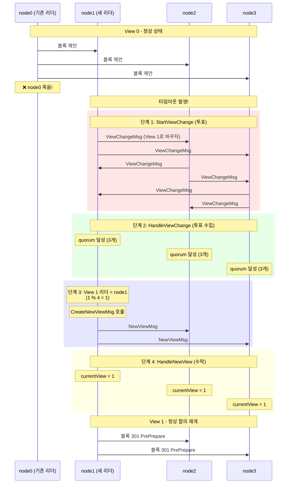
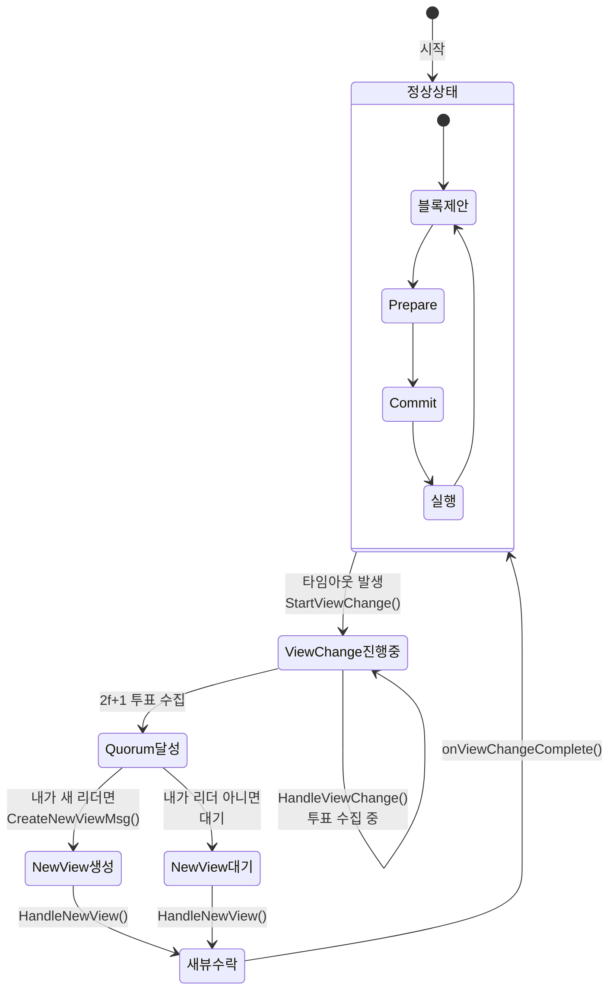
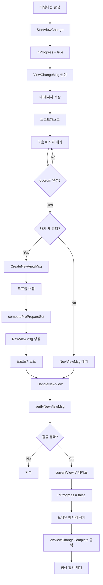
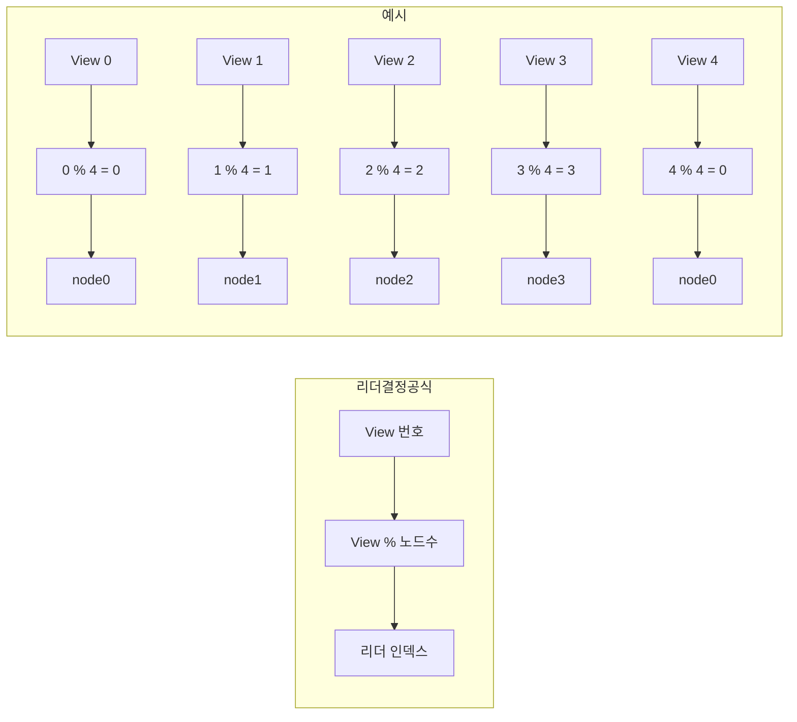
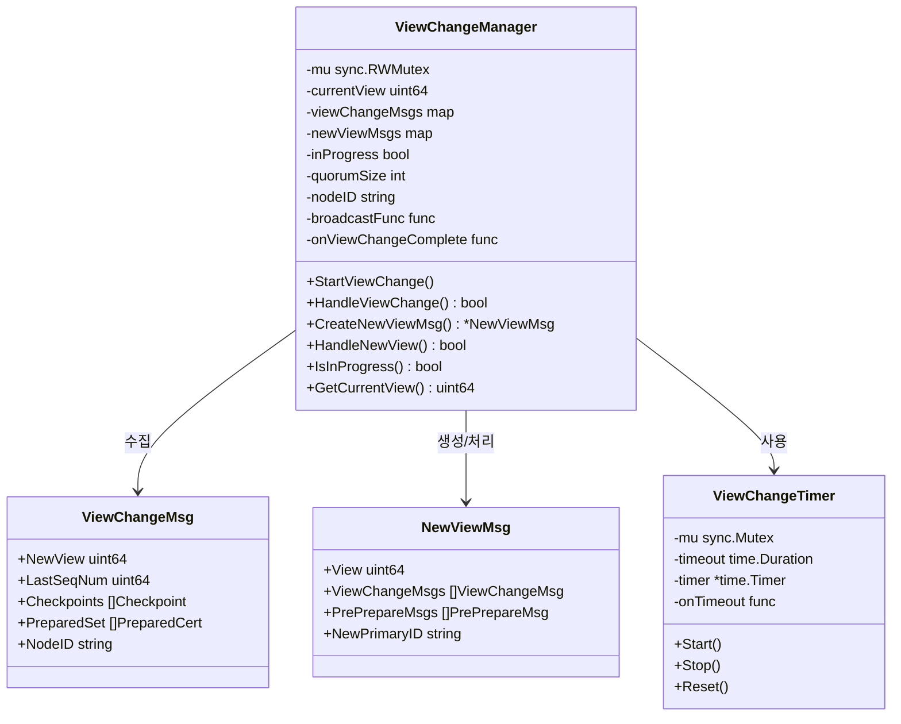
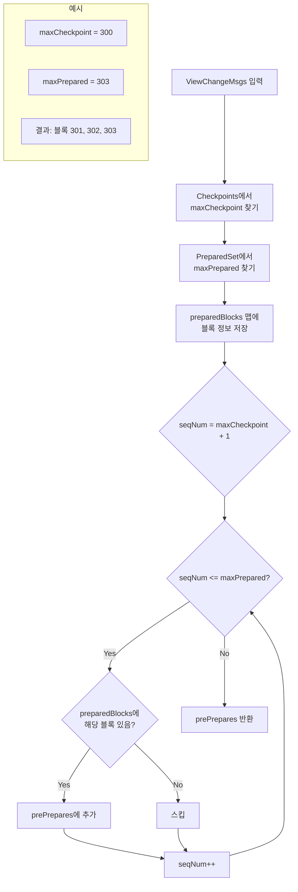
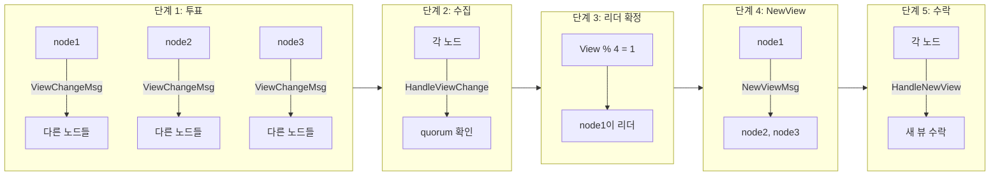

# PBFT View Change 플로우 다이어그램

## 1. 전체 시퀀스 다이어그램

```mermaid
sequenceDiagram
    participant N0 as node0 (기존 리더)
    participant N1 as node1 (새 리더)
    participant N2 as node2
    participant N3 as node3

    Note over N0,N3: View 0 - 정상 상태

    N0->>N1: 블록 제안
    N0->>N2: 블록 제안
    N0->>N3: 블록 제안

    Note over N0: ❌ node0 죽음!

    Note over N1,N3: 타임아웃 발생!

    rect rgb(255, 230, 230)
        Note over N1,N3: 단계 1: StartViewChange (투표)
        N1->>N2: ViewChangeMsg (View 1로 바꾸자)
        N1->>N3: ViewChangeMsg
        N2->>N1: ViewChangeMsg
        N2->>N3: ViewChangeMsg
        N3->>N1: ViewChangeMsg
        N3->>N2: ViewChangeMsg
    end

    rect rgb(230, 255, 230)
        Note over N1,N3: 단계 2: HandleViewChange (투표 수집)
        Note over N1: quorum 달성 (3개)
        Note over N2: quorum 달성 (3개)
        Note over N3: quorum 달성 (3개)
    end

    rect rgb(230, 230, 255)
        Note over N1: 단계 3: View 1 리더 = node1<br/>(1 % 4 = 1)
        Note over N1: CreateNewViewMsg 호출
        N1->>N2: NewViewMsg
        N1->>N3: NewViewMsg
    end

    rect rgb(255, 255, 230)
        Note over N1,N3: 단계 4: HandleNewView (수락)
        Note over N1: currentView = 1
        Note over N2: currentView = 1
        Note over N3: currentView = 1
    end

    Note over N1,N3: View 1 - 정상 합의 재개

    N1->>N2: 블록 301 PrePrepare
    N1->>N3: 블록 301 PrePrepare
```

## 2. 상태 머신 다이어그램

```mermaid
stateDiagram-v2
    [*] --> 정상상태: 시작

    정상상태 --> ViewChange진행중: 타임아웃 발생<br/>StartViewChange()

    ViewChange진행중 --> ViewChange진행중: HandleViewChange()<br/>투표 수집 중

    ViewChange진행중 --> Quorum달성: 2f+1 투표 수집

    Quorum달성 --> NewView생성: 내가 새 리더면<br/>CreateNewViewMsg()

    Quorum달성 --> NewView대기: 내가 리더 아니면<br/>대기

    NewView생성 --> 새뷰수락: HandleNewView()

    NewView대기 --> 새뷰수락: HandleNewView()

    새뷰수락 --> 정상상태: onViewChangeComplete()

    state 정상상태 {
        [*] --> 블록제안
        블록제안 --> Prepare
        Prepare --> Commit
        Commit --> 실행
        실행 --> 블록제안
    }
```

## 3. 함수 호출 플로우차트

```mermaid
flowchart TD
    A[타임아웃 발생] --> B[StartViewChange]
    
    B --> B1[inProgress = true]
    B1 --> B2[ViewChangeMsg 생성]
    B2 --> B3[내 메시지 저장]
    B3 --> B4[브로드캐스트]
    
    B4 --> C[HandleViewChange]
    
    C --> C1{quorum 달성?}
    C1 -->|No| C[다음 메시지 대기]
    C1 -->|Yes| D{내가 새 리더?}
    
    D -->|Yes| E[CreateNewViewMsg]
    D -->|No| F[NewViewMsg 대기]
    
    E --> E1[투표들 수집]
    E1 --> E2[computePrePrepareSet]
    E2 --> E3[NewViewMsg 생성]
    E3 --> E4[브로드캐스트]
    
    E4 --> G[HandleNewView]
    F --> G
    
    G --> G1[verifyNewViewMsg]
    G1 --> G2{검증 통과?}
    G2 -->|No| G3[거부]
    G2 -->|Yes| G4[currentView 업데이트]
    G4 --> G5[inProgress = false]
    G5 --> G6[오래된 메시지 삭제]
    G6 --> G7[onViewChangeComplete 콜백]
    
    G7 --> H[정상 합의 재개]
```

## 4. 리더 결정 방식

```mermaid
flowchart LR
    subgraph 리더결정공식
        A[View 번호] --> B[View % 노드수]
        B --> C[리더 인덱스]
    end
    
    subgraph 예시
        D[View 0] --> E[0 % 4 = 0] --> F[node0]
        G[View 1] --> H[1 % 4 = 1] --> I[node1]
        J[View 2] --> K[2 % 4 = 2] --> L[node2]
        M[View 3] --> N[3 % 4 = 3] --> O[node3]
        P[View 4] --> Q[4 % 4 = 0] --> R[node0]
    end
```

## 5. 데이터 구조

```mermaid
classDiagram
    class ViewChangeManager {
        -mu sync.RWMutex
        -currentView uint64
        -viewChangeMsgs map
        -newViewMsgs map
        -inProgress bool
        -quorumSize int
        -nodeID string
        -broadcastFunc func
        -onViewChangeComplete func
        +StartViewChange()
        +HandleViewChange() bool
        +CreateNewViewMsg() *NewViewMsg
        +HandleNewView() bool
        +IsInProgress() bool
        +GetCurrentView() uint64
    }
    
    class ViewChangeMsg {
        +NewView uint64
        +LastSeqNum uint64
        +Checkpoints []Checkpoint
        +PreparedSet []PreparedCert
        +NodeID string
    }
    
    class NewViewMsg {
        +View uint64
        +ViewChangeMsgs []ViewChangeMsg
        +PrePrepareMsgs []PrePrepareMsg
        +NewPrimaryID string
    }
    
    class ViewChangeTimer {
        -mu sync.Mutex
        -timeout time.Duration
        -timer *time.Timer
        -onTimeout func
        +Start()
        +Stop()
        +Reset()
    }
    
    ViewChangeManager --> ViewChangeMsg : 수집
    ViewChangeManager --> NewViewMsg : 생성/처리
    ViewChangeManager --> ViewChangeTimer : 사용
```

## 6. computePrePrepareSet 로직

```mermaid
flowchart TD
    A[ViewChangeMsgs 입력] --> B[Checkpoints에서<br/>maxCheckpoint 찾기]
    
    B --> C[PreparedSet에서<br/>maxPrepared 찾기]
    
    C --> D[preparedBlocks 맵에<br/>블록 정보 저장]
    
    D --> E{seqNum = maxCheckpoint + 1}
    
    E --> F{seqNum <= maxPrepared?}
    
    F -->|Yes| G{preparedBlocks에<br/>해당 블록 있음?}
    G -->|Yes| H[prePrepares에 추가]
    G -->|No| I[스킵]
    H --> J[seqNum++]
    I --> J
    J --> F
    
    F -->|No| K[prePrepares 반환]
    
    subgraph 예시
        L[maxCheckpoint = 300]
        M[maxPrepared = 303]
        N[결과: 블록 301, 302, 303]
    end
```

## 7. 상태 변화 타임라인

```mermaid
gantt
    title View Change 상태 변화
    dateFormat X
    axisFormat %s
    
    section currentView
    View 0     :a1, 0, 50
    View 1     :a2, 50, 100
    
    section inProgress
    false      :b1, 0, 20
    true       :crit, b2, 20, 50
    false      :b3, 50, 100
    
    section 단계
    정상 상태           :c1, 0, 10
    타임아웃            :crit, c2, 10, 15
    StartViewChange     :c3, 15, 25
    HandleViewChange    :c4, 25, 35
    CreateNewViewMsg    :c5, 35, 45
    HandleNewView       :c6, 45, 55
    정상 합의 재개      :c7, 55, 100
```

## 8. 메시지 흐름 요약

```mermaid
flowchart LR
    subgraph 단계1[단계 1: 투표]
        A1[node1] -->|ViewChangeMsg| A2[다른 노드들]
        A3[node2] -->|ViewChangeMsg| A4[다른 노드들]
        A5[node3] -->|ViewChangeMsg| A6[다른 노드들]
    end
    
    subgraph 단계2[단계 2: 수집]
        B1[각 노드] -->|HandleViewChange| B2[quorum 확인]
    end
    
    subgraph 단계3[단계 3: 리더 확정]
        C1[View % 4 = 1] --> C2[node1이 리더]
    end
    
    subgraph 단계4[단계 4: NewView]
        D1[node1] -->|NewViewMsg| D2[node2, node3]
    end
    
    subgraph 단계5[단계 5: 수락]
        E1[각 노드] -->|HandleNewView| E2[새 뷰 수락]
    end
    
    단계1 --> 단계2 --> 단계3 --> 단계4 --> 단계5
```
