# PBFT View Change 타임아웃 상세 플로우

## 타임아웃이란?

```
타임아웃 = "리더가 일정 시간 동안 응답이 없으면 리더 교체"

기본 타임아웃: 10초
뷰 체인지 실패 시: 타임아웃 2배씩 증가 (exponential backoff)
```

---

## 1. 타임아웃 발생 조건

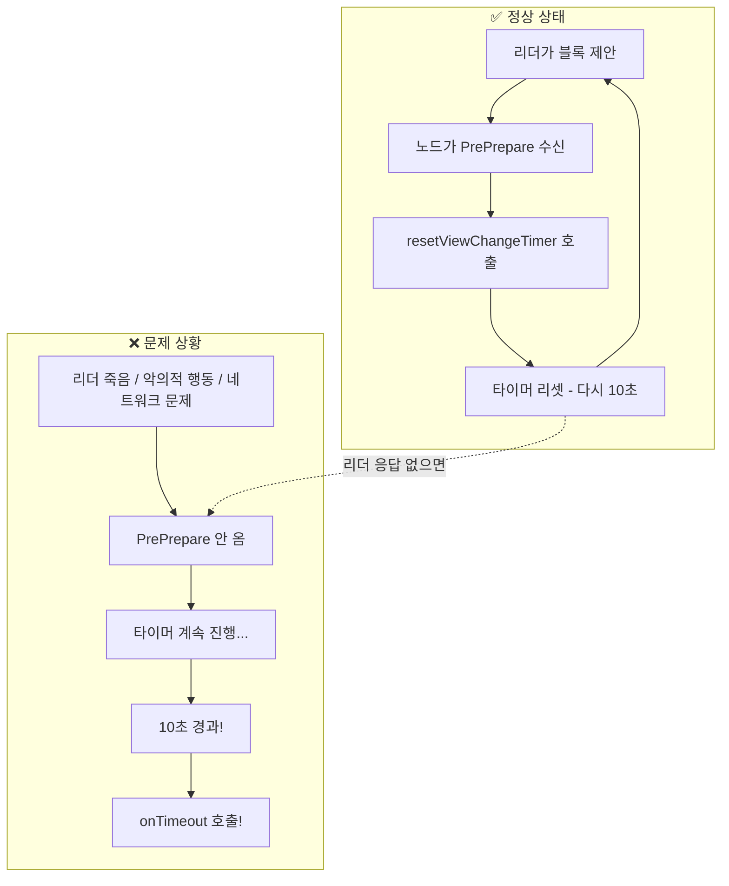

---

## 2. 타이머 관련 코드 흐름

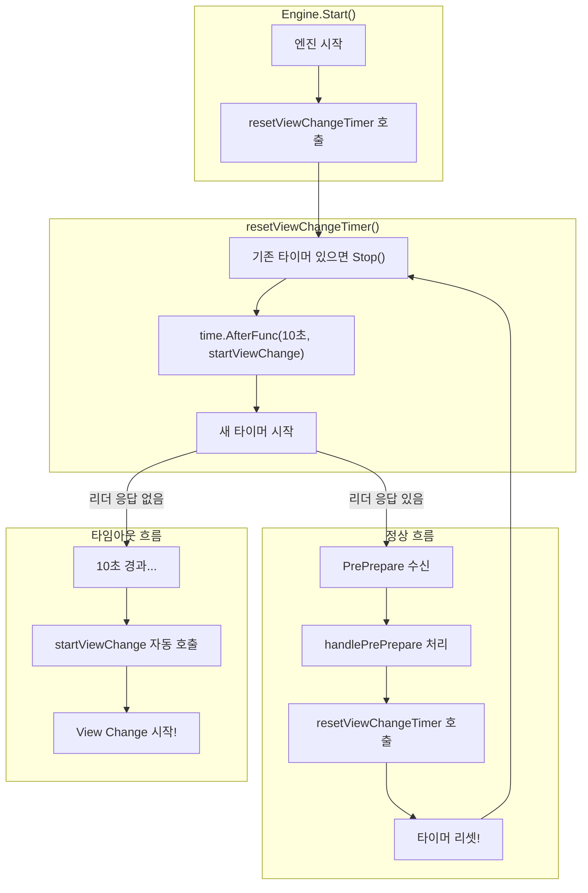

---

## 3. 단일 리더 죽음 시나리오

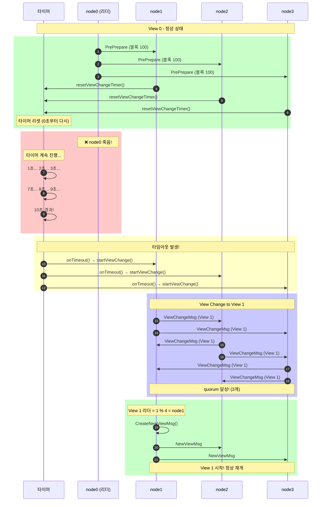

---

## 4. 연속 리더 죽음 시나리오 (node0, node1 둘 다 죽음)

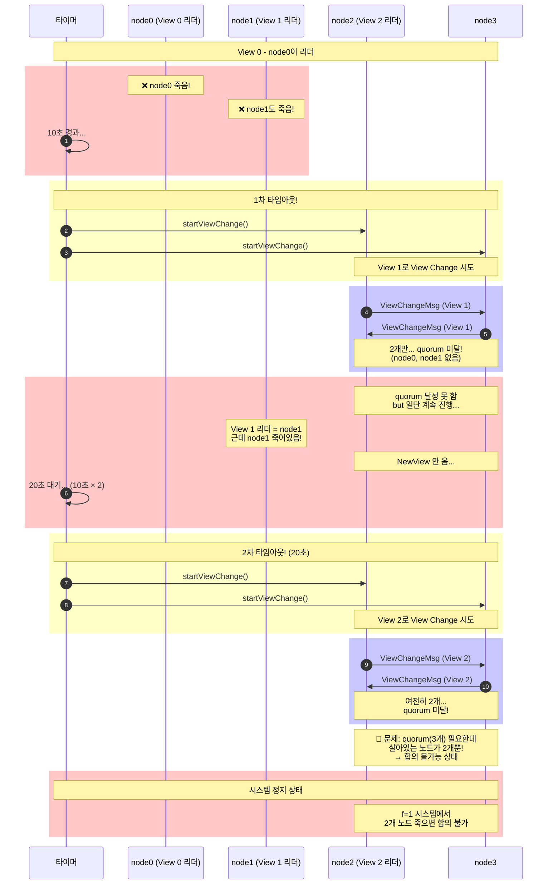

---

## 5. 연속 리더 죽음 + 복구 시나리오 (node0만 죽고, node1은 나중에 응답)

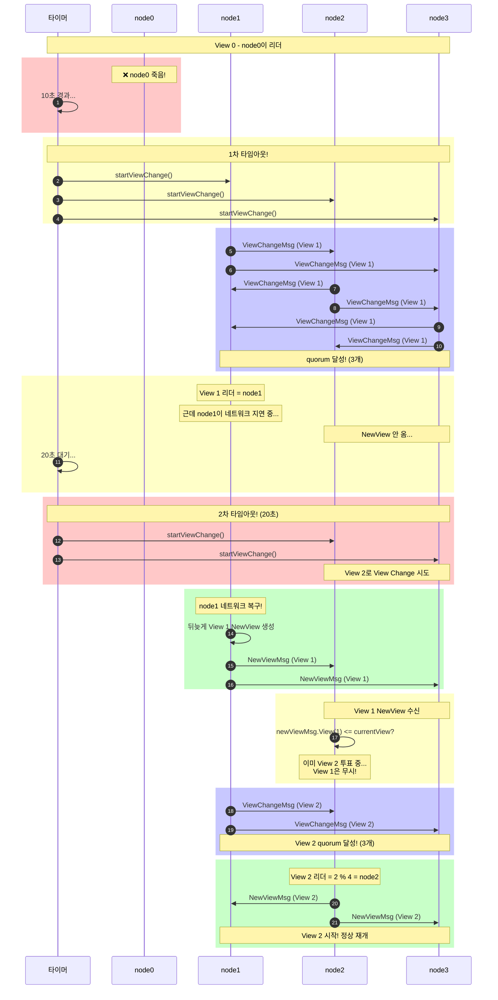

---

## 6. 타임아웃 증가 (Exponential Backoff) 상세

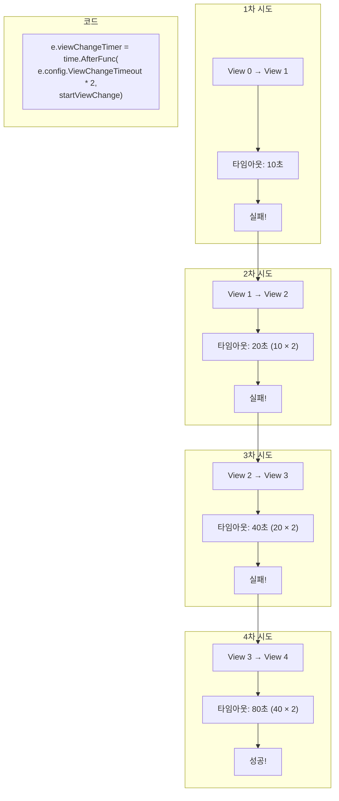

```mermaid
gantt
    title 타임아웃 증가 타임라인
    dateFormat s
    axisFormat %S초

    section View 0
    정상 상태           :a1, 0, 10
    
    section View 1 시도
    타임아웃 대기 (10초) :crit, b1, 10, 20
    View Change 시도    :b2, 20, 22
    NewView 대기        :b3, 22, 25
    실패!               :crit, b4, 25, 26

    section View 2 시도
    타임아웃 대기 (20초) :crit, c1, 26, 46
    View Change 시도    :c2, 46, 48
    NewView 대기        :c3, 48, 51
    실패!               :crit, c4, 51, 52

    section View 3 시도
    타임아웃 대기 (40초) :crit, d1, 52, 92
    View Change 시도    :d2, 92, 94
    NewView 수신        :d3, 94, 96
    성공!               :done, d4, 96, 100
```

---

## 7. startViewChange 상세 흐름

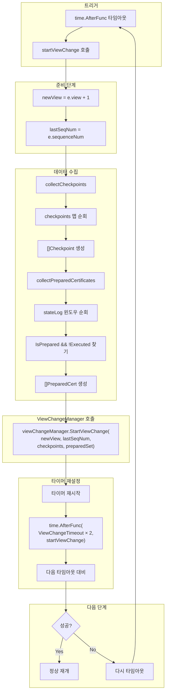

---

## 8. resetViewChangeTimer 상세 흐름

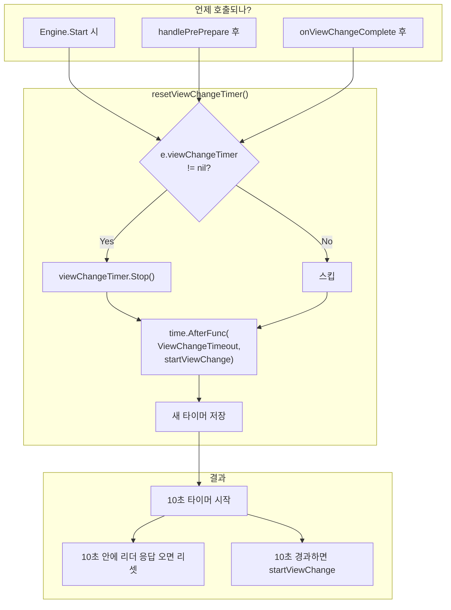

---

## 9. 전체 타임아웃 상태 머신

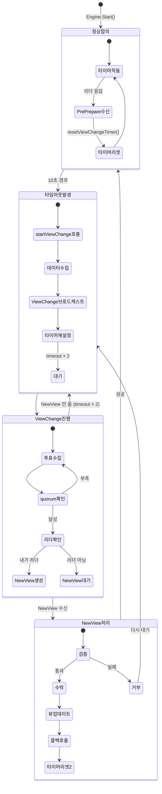

---

## 10. 노드별 타이머 상태 (독립적)

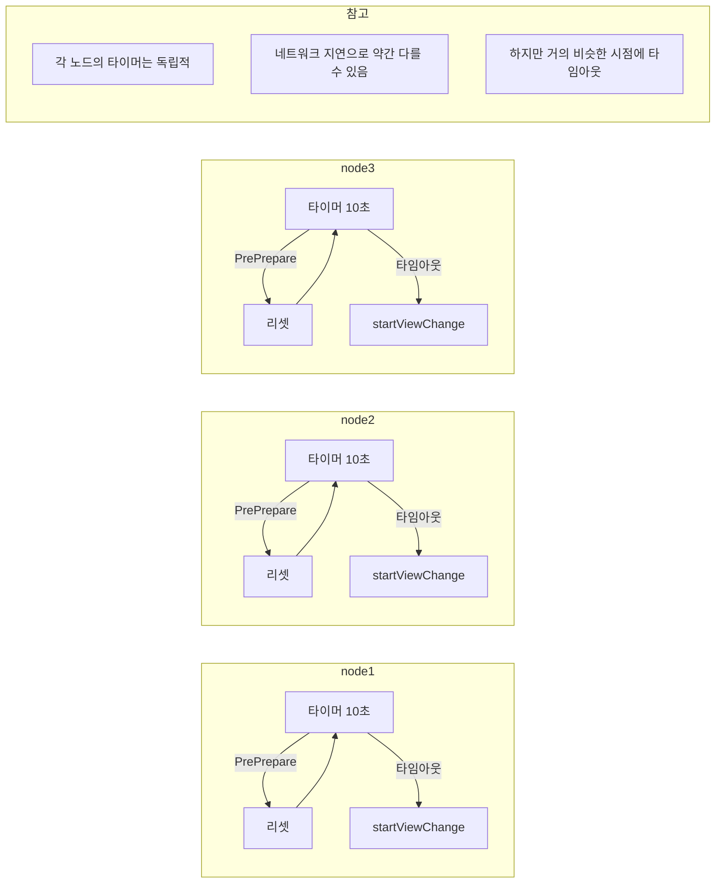

---

## 11. 실제 시간 흐름 예시

```
시간(초)  node0(리더)    node1         node2         node3
━━━━━━━━━━━━━━━━━━━━━━━━━━━━━━━━━━━━━━━━━━━━━━━━━━━━━━━━━━━━━━━
  0      블록 제안 ──────────────────────────────────────────►
  1                     타이머 리셋    타이머 리셋    타이머 리셋
  2      블록 제안 ──────────────────────────────────────────►
  3                     타이머 리셋    타이머 리셋    타이머 리셋
  4      ❌ 죽음!
  5                     타이머: 1초    타이머: 1초    타이머: 1초
  6                     타이머: 2초    타이머: 2초    타이머: 2초
  ...
  13                    타이머: 9초    타이머: 9초    타이머: 9초
  14                    ⏰ 10초!       ⏰ 10초!       ⏰ 10초!
  15                    startVC()     startVC()     startVC()
  16                    ──ViewChangeMsg 교환──────────────────
  17                    quorum!       quorum!       quorum!
  18                    CreateNewView
  19                    ──NewViewMsg 브로드캐스트────────────►
  20                    HandleNewView HandleNewView HandleNewView
  21                    View 1 시작!  View 1 시작!  View 1 시작!
━━━━━━━━━━━━━━━━━━━━━━━━━━━━━━━━━━━━━━━━━━━━━━━━━━━━━━━━━━━━━━━
```

---

## 12. 타임아웃 관련 설정

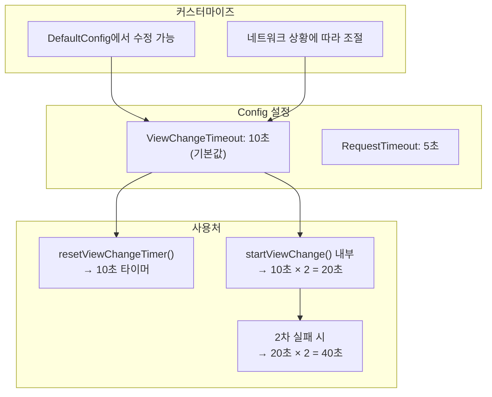

---

## 요약

```
타임아웃 핵심 포인트:

1. 기본 타임아웃: 10초
2. 리더가 PrePrepare 보내면 타이머 리셋
3. 타임아웃 발생 시 startViewChange() 자동 호출
4. View Change 실패 시 타임아웃 2배로 증가 (exponential backoff)
5. 각 노드의 타이머는 독립적
6. 여러 리더가 연속으로 죽으면 계속 View 증가
7. quorum 불가능하면 시스템 정지 (f+1개 이상 살아있어야 함)
```
